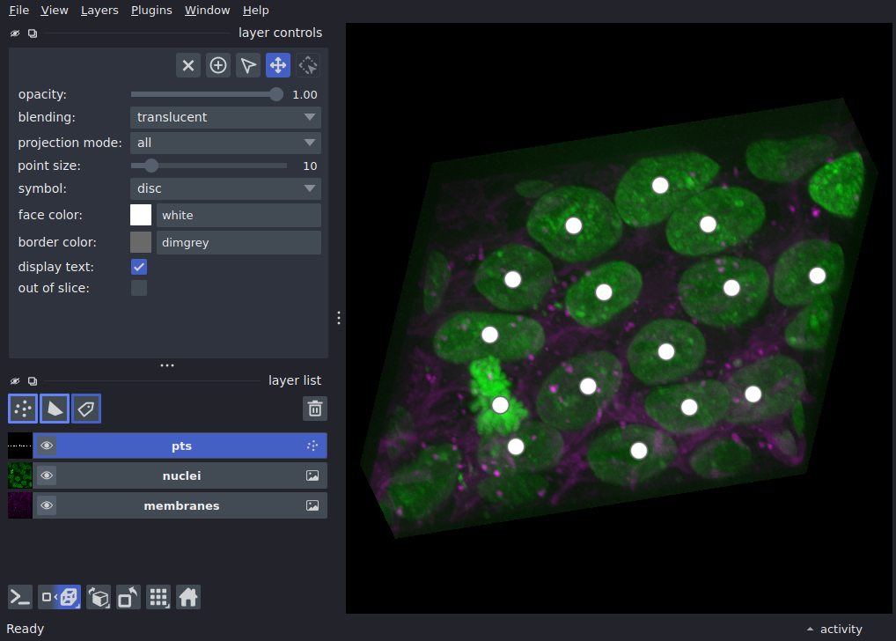

napari express 🚀
===

<!-- alignment: center -->
<!-- new_lines: 4 -->


[](https://napari.org/workshops/express)

napa-what?
===

<!-- new_lines: 1 -->
<!-- alignment: center -->

a scientific image viewer for python

<!-- new_lines: 1 -->
<!-- column_layout: [3, 2] -->
<!-- column: 0 -->

<!-- column: 1 -->
<!-- new_lines: 4 -->
<!-- incremental_lists: true -->
<!-- list_item_newlines: 2 -->
<!-- alignment: left -->
- n-dimensional
- interactive
- performant
- extensible
- pythonic


array -> interactive visualization
===

<!-- alignment: center -->
<!-- new_lines: 4 -->

```python +exec
from skimage import data
import napari

image = data.cells3d()
viewer, layers = napari.imshow(image, channel_axis=1, ndisplay=3)
napari.run()
```


express 🚀 tutorial overview
===

<!-- alignment: center -->
<!-- new_lines: 4 -->
<!-- incremental_lists: true -->
<!-- list_item_newlines: 3 -->

From clunky python script to interactive, distributable interface:
<!-- new_lines: 2 -->

1. from pure Python to interactive napari widget

2. building a segmentation pipeline

3. adding interactive classification and going 3D


core concepts and the napari interface
===

<!-- alignment: center -->
<!-- new_lines: 4 -->
<!-- list_item_newlines: 3 -->

1. launch napari (`uv run napari`)
2. **Lightning introduction to the napari GUI**
3. Drag'n'Drop the `00_lightning_gui_intro.py` button on to the napari canvas

let's begin!
===

<!-- alignment: center -->
<!-- new_lines: 4 -->


quick feedback form
===


<!-- alignment: center -->
<!-- new_lines: 4 -->


~3 minutes, all anonymous!


links and resources
===

<!-- alignment: center -->
<!-- new_lines: 4 -->
<!-- list_item_newlines: 3 -->
- quick chat: [](https://napari.zulipchat.com)
- community meetings: [](https://napari.org/stable/community/meeting_schedule.html)
- search existing plugins: [](https://napari-hub.org)
- issues and feature requests: [](https://github.com/napari/napari)
- everything else: [](https://napari.org)

<!-- new_lines: 2 -->
<3

<!-- alignment: center -->
